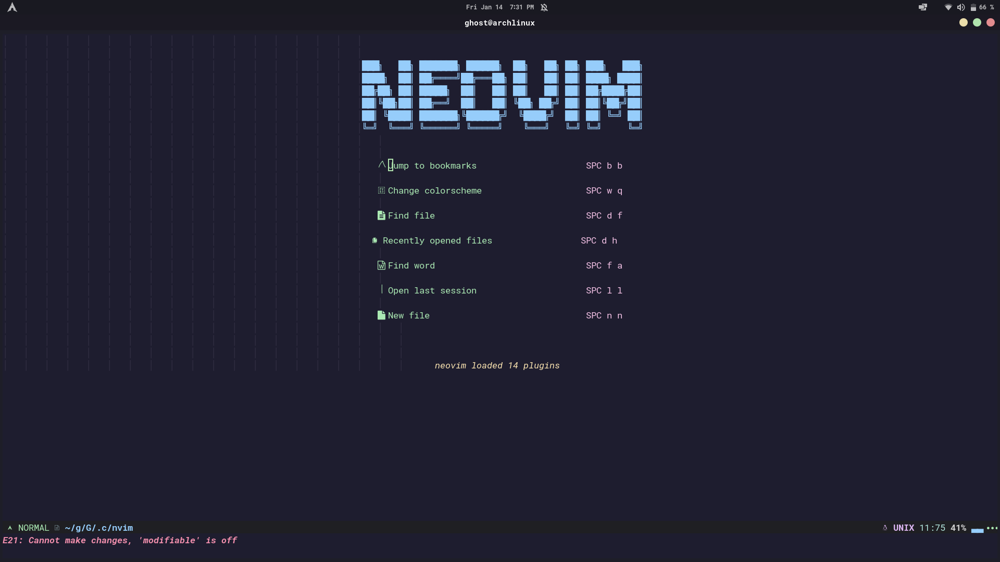
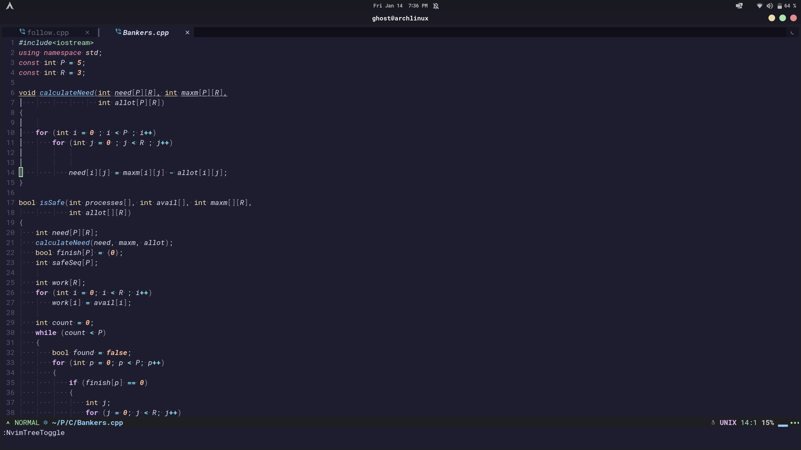

# NVIM Config 
## This configuration is based on the catppuccin colorscheme. 

# Screenshots
<p align="center">
    
    
</p>
# Steps 
1. Install nvim 
```
sudo pacman -S nvim
```
2. Move `nvim/` to `~/.config`
3. Open nvim and type `:PlugInstall` and restart nvim. 


