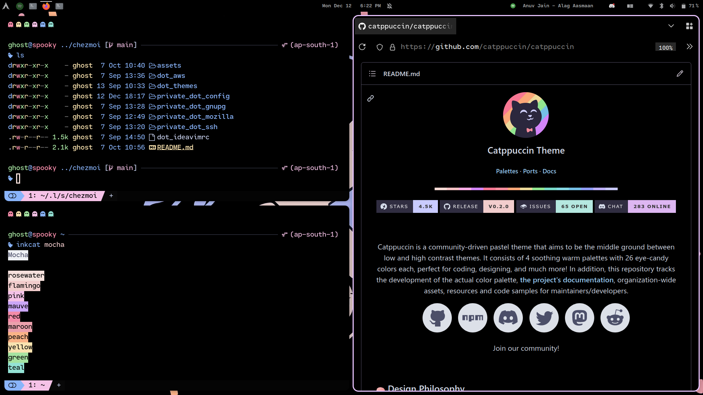

    <h2>My dotfiles </h2>

 

### What I use
- OS: Arch Linux
- DE: Gnome 
- Shell: [Fish](https://fishshell.com/) with [Starship prompt](https://starship.rs)
- Terminal: [WezTerm](https://wezfurlong.org/wezterm/)
- Colorscheme: [Catppuccin](https://github.com/catppuccin)
- Icons: [Tela](https://github.com/vinceliuice/Tela-icon-theme) 

### Extensions I use: 
- [BaBar](https://extensions.gnome.org/extension/4000/babar/)
- [GTK Title Bar](https://extensions.gnome.org/extension/1732/gtk-title-bar/)
- [Just Perfection](https://extensions.gnome.org/extension/3843/just-perfection/)
- [Logo Menu](https://extensions.gnome.org/extension/4451/logo-menu/)
- [Media Controls](https://extensions.gnome.org/extension/4470/media-controls/)
- [Blur my Shell](https://extensions.gnome.org/extension/3193/blur-my-shell/)
- [Space bar](https://extensions.gnome.org/extension/5090/space-bar/)
