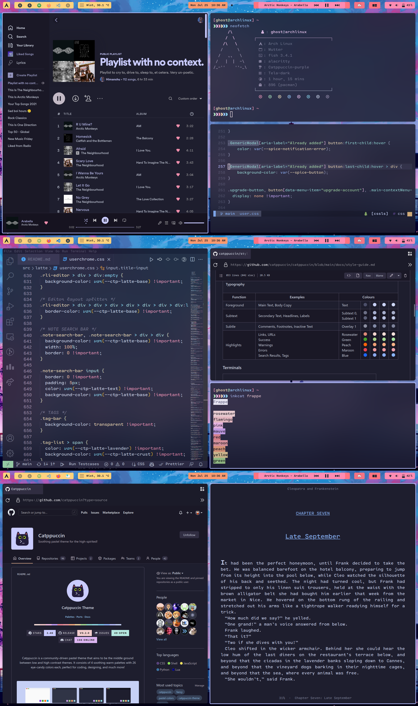
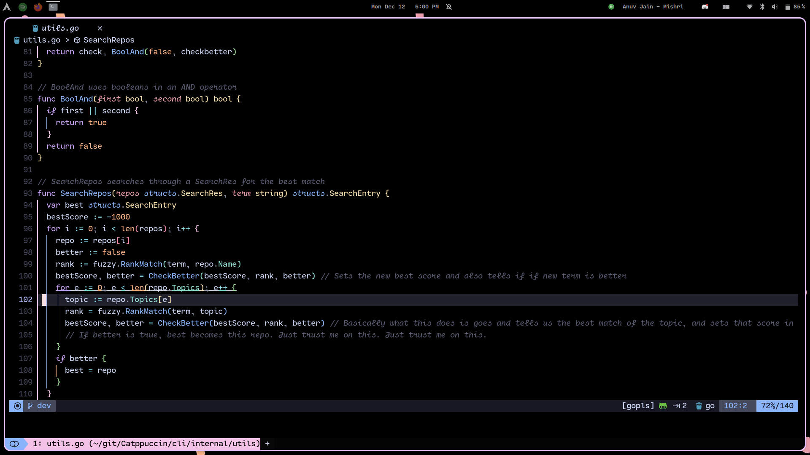
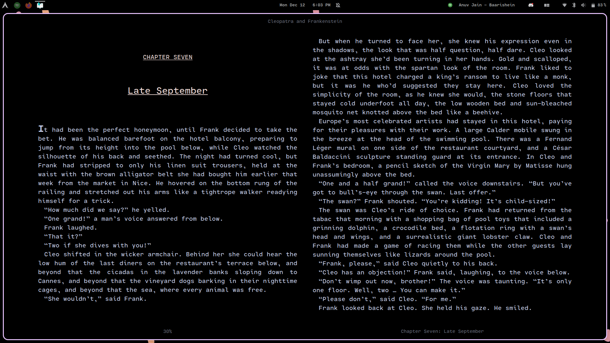
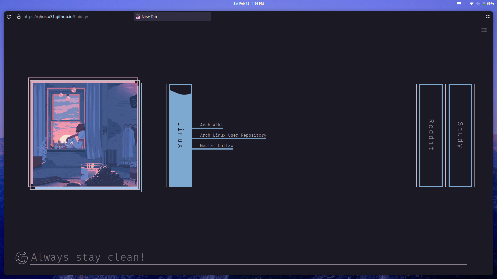
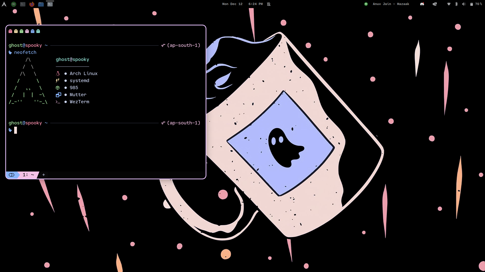

    <h2>My config files for Arch Linux 😽️ </h2>

 

### About my setup:
- OS: Arch Linux
- DE: Gnome 
- Shell: Fish 
- Terminal: Alacritty
- Colorscheme: [Catppuccin](https://github.com/catppuccin/catppuccin)
- Icons: Tela-dark

### Extensions I use: 
- [BaBar](https://extensions.gnome.org/extension/4000/babar/)
- [GTK Title Bar](https://extensions.gnome.org/extension/1732/gtk-title-bar/)
- [Just Perfection](https://extensions.gnome.org/extension/3843/just-perfection/)
- [Logo Menu](https://extensions.gnome.org/extension/4451/logo-menu/)
- [Media Controls](https://extensions.gnome.org/extension/4470/media-controls/)
- [Blur my Shell](https://extensions.gnome.org/extension/3193/blur-my-shell/)
- [Dash to Dock for Cosmic](https://extensions.gnome.org/extension/5004/dash-to-dock-for-cosmic/)
 

 

> :warning: **I am now using chezmoi to store my encrypted secrets as well and thus can be decrypted with only my PGP key. If you perform `chezmoi apply`, you risk losing your `~/.ssh` and `~/.gnupg`. Do not apply these dots if you're not me!**

# Application configs: 

## LunarVim 🖊️

- [LunarVim config](https://github.com/ghostx31/dotfiles/tree/main/private_dot_config/lvim)

 
   

 

 
 

 
 
 
 

## Foliate 📔️ 

- [Foliate](https://github.com/ghostx31/dotfiles/tree/main/privat_dot_config/com.github.johnfactotum.Foliate/themes.json)

 
   
 
 
 
 
 
 
 

## Firefox 🌐️

- Based on [cascade](https://github.com/andreasgrafen/cascade): [Config](https://github.com/ghostx31/dotfiles/tree/main/firefox)
- Startpage: [Dawn](https://dawn.spookyintheam.codes/)

 
   

 

 
 

 
 
 

## WezTerm 💻️ 

- [WezTerm config](https://github.com/ghostx31/dotfiles/tree/main/private_dot_config/wezterm/wezterm.lua)
