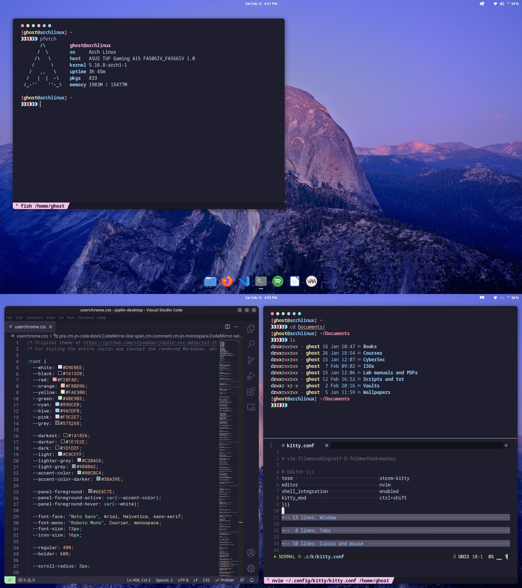
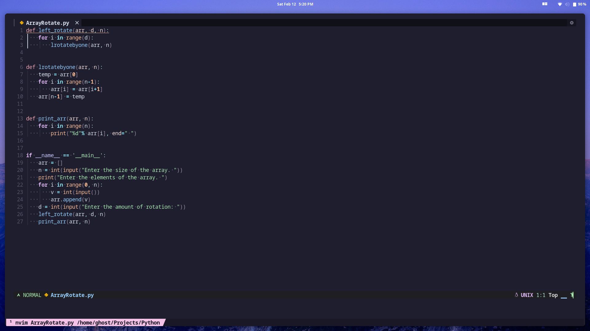
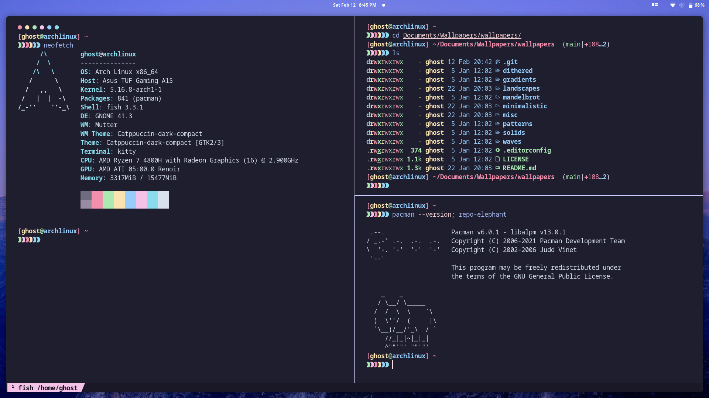

    <b> My config files for Arch Linux 😽️ </b>

 

About my setup:
- OS: Arch Linux
- DE: Gnome 
- Shell: Fish shell
- Terminal: Kitty
- Colorscheme: [Catppuccin](https://github.com/catppuccin/catppuccin)
- Icons: Tela-dark
 
 
 
 
 

# Application configs: 

## Neovim 🖊️

- [Nvim config](https://github.com/ghostx31/Gnome-catppuccin/tree/main/.config/nvim)

 
   

 

 
 

 
 
 
 

## Foliate 📔️ 

- [Foliate](https://github.com/ghostx31/Gnome-catppuccin/tree/main/.config/com.github.johnfactotum.Foliate)

 
   

 

 
 

 
 
 
 

## Firefox 🌐️

- Based on [cascade](https://github.com/andreasgrafen/cascade): [Config](https://github.com/ghostx31/Gnome-catppuccin/tree/main/firefox)
- Startpage: [Fluidity](https://ghostx31.github.io/fluidity/)

 
   

 

 
 

 
 
 

## Kitty 💻️ 

- [Kitty config](https://github.com/ghostx31/Gnome-catppuccin/tree/main/.config/kitty)
 
   

 

 
 

 
 
 
 

# Todo 💭️ 
- Add a bash script to make installation easier. 
