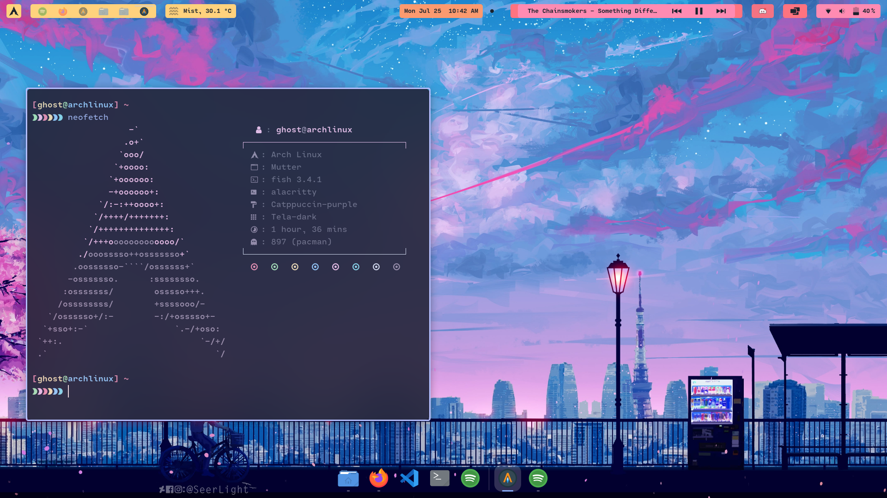

    <h2>My config files for Arch Linux 😽️ </h2>

 

About my setup:
- OS: Arch Linux
- DE: Gnome 
- Shell: Fish 
- Terminal: Alacritty
- Colorscheme: [Catppuccin](https://github.com/catppuccin/catppuccin)
- Icons: Tela-dark
 
 
 
 
 
 
   
   
   
   

> :warning: **I am now using chezmoi to store my encrypted secrets as well and thus can be decrypted with only my PGP key. If you perform `chezmoi apply`, you risk losing your `~/.ssh` and `~/.gnupg`. Do not apply these dots if you're not me!**

# Application configs: 

## LunarVim 🖊️

- [LunarVim config](https://github.com/ghostx31/dotfiles/tree/main/.config/lvim)

 
   

 

 
 

 
 
 
 

## Foliate 📔️ 

- [Foliate](https://github.com/ghostx31/dotfiles/tree/main/.config/com.github.johnfactotum.Foliate/themes.json)

 
   

 

 
 

 
 
 
 

## Firefox 🌐️

- Based on [cascade](https://github.com/andreasgrafen/cascade): [Config](https://github.com/ghostx31/dotfiles/tree/main/firefox)
- Startpage: [Dawn](https://ghostx31.github.io/dawn/)

 
   

 

 
 

 
 
 

## Alacritty 💻️ 

- [Alacritty config](https://github.com/ghostx31/dotfiles/tree/main/.config/alacritty.yml)
